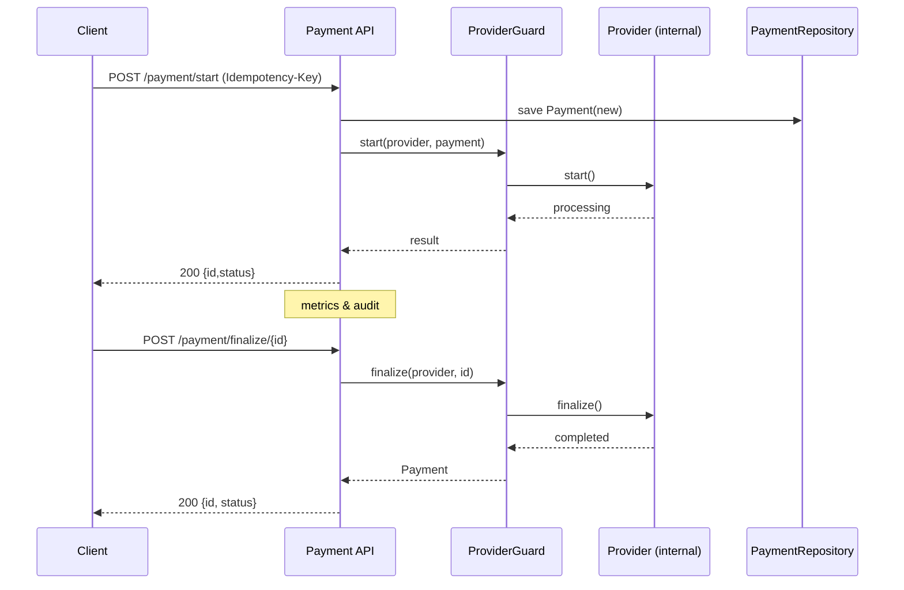

# Sequence — Start → Finalize (internal)

```mermaid
sequenceDiagram
  participant C as Client
  participant API as Payment API
  participant Guard as ProviderGuard
  participant Prov as Provider (internal)
  participant Repo as PaymentRepository

  C->>API: POST /payment/start (Idempotency-Key)
  API->>Repo: save Payment(new)
  API->>Guard: start(provider, payment)
  Guard->>Prov: start()
  Prov-->>Guard: processing
  Guard-->>API: result
  API-->>C: 200 {id,status}
  Note over API: metrics & audit
  C->>API: POST /payment/finalize/{id}
  API->>Guard: finalize(provider, id)
  Guard->>Prov: finalize()
  Prov-->>Guard: completed
  Guard-->>API: Payment
  API-->>C: 200 {id, status}
```
